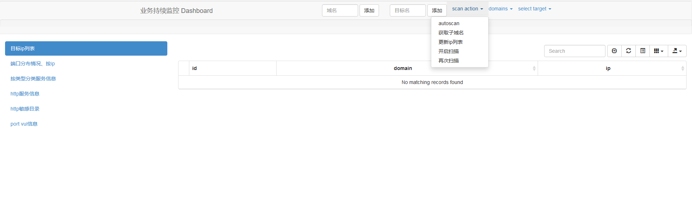

# 说明
  域名|ip段基本信息刺探

  - 搜集粗略一个目标的大部分服务器信息，并对部分简单漏洞进行刺探。
  - 子域名爆破直接用了lijiejie的[subDomainsBrute](https://github.com/lijiejie/subDomainsBrute)
  - 端口扫描 python-nmap


  ### 存在问题 单机版，容易死。


# ubuntu 安装依赖
```
apt-get install -y  python-pip python-dev libldap2-dev libsasl2-dev libssl-dev libffi-dev docker.io libxml2-dev libxslt-dev

pip install -r requirements.txt
```

# mongo配置
```
sudo docker run --name mongo -d -p 27017:27017 mongo --auth
docker exec -it mongo mongo admin
db.createUser({ user: 'username', pwd: 'passwd', roles: [ { role: "__system", db: "admin" } ] });
```

# web管理界面


### 运行scan_monitor.py， 访问 http://ip:8888/index


